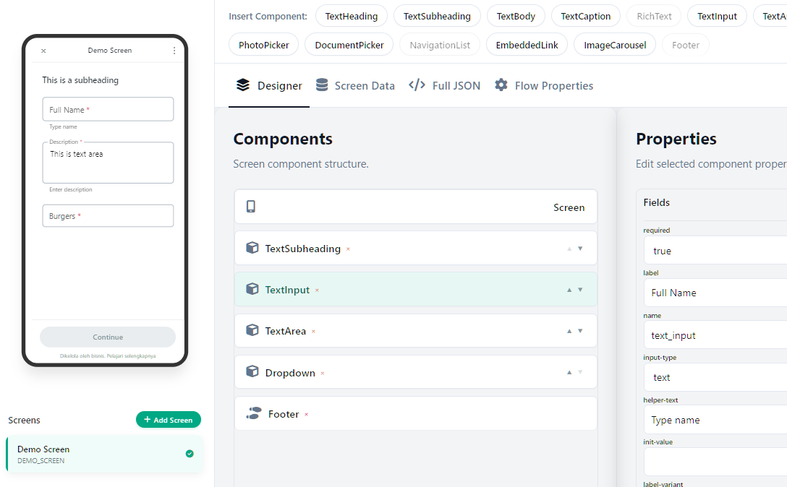

# FLO - Visual WhatsApp Flow Designer

**FLO** is the most advanced visual designer for creating WhatsApp Flows without writing JSON code manually. Build interactive, premium, and professional conversational experiences in minutes.

## ✨ Key Features

- **Visual Designer**: Drag-and-drop-like experience to add components such as `TextInput`, `DatePicker`, `CheckboxGroup`, and `ImageCarousel` with a single click.
- **Real-Time Preview**: See exactly how your flow looks and feels on a mobile simulator as you build.
- **Multi-Screen Support**: Create complex journeys with multiple screens and smart navigation settings.
- **Smart Data Binding**: Connect your UI to dynamic data using the `${data.variable}` token system.
- **Auto-Terminal Logic**: An intelligent system that automatically detects the "terminal" status of your screens to ensure your Flow is always valid.
- **Markdown Editor**: Personalize your text with rich Markdown support for a more aesthetic result.

## 🚀 Get Started Now

You can immediately try and use FLO online through the link below:

### 👉 [https://flo.wame.id](https://flo.wame.id)

---

## 📝 License

This application follows a **Freemium** model:
- **Free Tier**: You can create and manage up to **2 screens** per Flow for free.
- **Premium Tier**: Unlimited screens and full feature access for paid users.

Modifying the source code to bypass these limits is strictly prohibited. For more details, see the [LICENSE](LICENSE) file.

